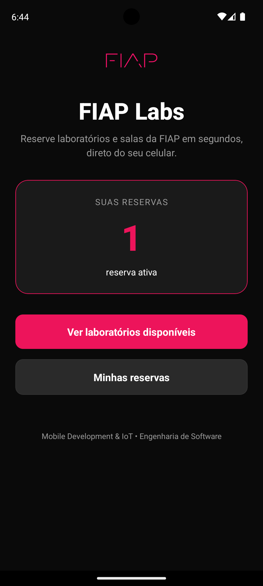
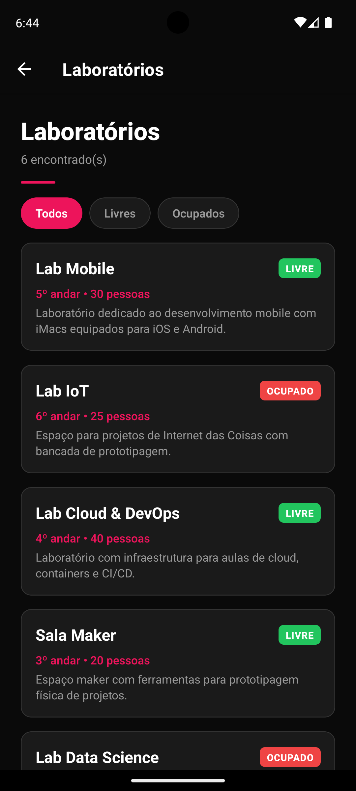
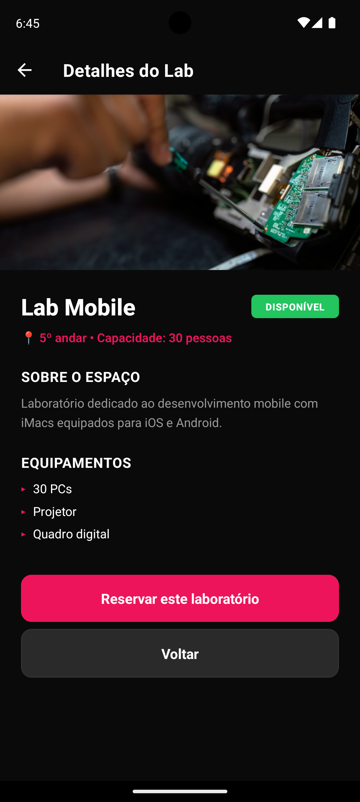
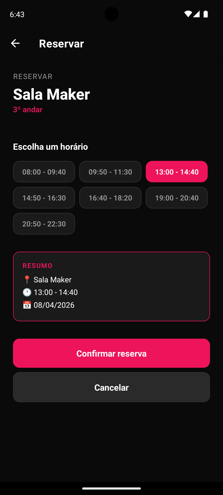
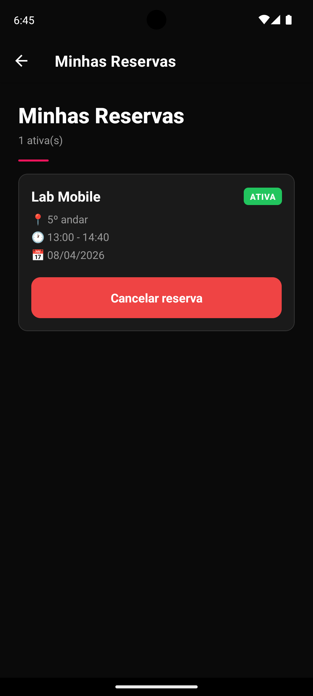
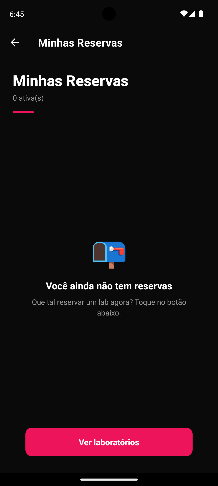

# 📱 FIAP Labs

Checkpoint 1: **Mobile Development & IoT**

---

## 🎯 Sobre o Projeto

O **FIAP Labs** é um app mobile que permite ao aluno:

- 🔍 Ver em tempo real quais laboratórios e salas estão livres ou ocupados
- 📋 Consultar detalhes de cada espaço (capacidade, andar, equipamentos disponíveis)
- 📅 Reservar um horário específico em poucos toques
- 📌 Acompanhar suas reservas ativas e cancelá-las quando necessário

### Funcionalidades implementadas

- ✅ Listagem de laboratórios com filtro por status (todos / livres / ocupados)
- ✅ Tela de detalhes do laboratório com informações completas
- ✅ Fluxo de reserva com seleção de horário e resumo antes da confirmação
- ✅ Tela "Minhas Reservas" com cancelamento e confirmação por alerta

---

## 👥 Integrantes do Grupo

| Nome | RM |
|---|---|
| Marcos Vinicius da Silva Costa | 555490 |
| Rafael Federici de Oliveira | 554736 |

---

## 🚀 Como Rodar o Projeto

### Pré-requisitos

- [**Node.js**](https://nodejs.org/)
- **Expo Go** ([Android](https://play.google.com/store/apps/details?id=host.exp.exponent) / [iOS](https://apps.apple.com/app/expo-go/id982107779)) ou [**AndroidStudio**](https://developer.android.com/studio?hl=pt-br)

### Passo a passo

```bash
# 1. Clone o repositório
git clone https://github.com/yRaffa/fiap-mdi-cp1-labs-app

# 2. Entre na pasta
cd fiap-mdi-cp1-labs-app

# 3. Instale as dependências
npm install

# 4. Rode o projeto
npx expo start
```

---

## 📸 Demonstração

### Telas do app

| Tela Inicial | Lista de Labs | Detalhes |
|---|---|---|
|  |  |  |

| Reserva | Minhas Reservas | Sem Reserva |
|---|---|---|
|  |  |  |

---

<div align="center">
    <h3>Video Demonstrativo</h3>
    
</div>

---

## 💻 Decisões Técnicas

A separação por pastas (`components`, `context`, `constants`, `data`) garante que **nenhum arquivo concentre toda a lógica**, atendendo ao requisito de componentização. Cada parte tem uma responsabilidade clara.

### Hooks utilizados

| Hook | Onde | Para quê |
|---|---|---|
| `useState` | `labs.js`, `reservar/[id].js`, `ReservasContext.js` | Gerenciar filtro selecionado, horário escolhido, estado de carregamento e a lista de reservas |
| `useEffect` | `labs.js` | Simular um carregamento inicial dos laboratórios (loading state com `ActivityIndicator`) |
| `useContext` (via `useReservas`) | `index.js`, `reservar/[id].js`, `minhas-reservas.js` | Compartilhar o estado das reservas entre múltiplas telas sem prop drilling |
| `useRouter` / `useLocalSearchParams` | Várias telas | Navegação programática e leitura de parâmetros de rota |

### Navegação

A navegação foi implementada com **Expo Router** (file-based routing). Cada arquivo dentro de `app/` é uma rota:

- `/` → Home
- `/labs` → Listagem
- `/lab/[id]` → Detalhes (rota dinâmica)
- `/reservar/[id]` → Tela de reserva
- `/minhas-reservas` → Reservas do usuário

O `Stack` configurado em `_layout.js` mantém um header consistente, com tema escuro alinhado à identidade da FIAP.

### Estado global

Como múltiplas telas precisam ler e modificar a lista de reservas, foi criado um `ReservasContext` que envolve toda a aplicação. Internamente ele usa apenas `useState` — sem bibliotecas externas.

### Estilização

Toda a estilização é feita com `StyleSheet.create()`. As cores, espaçamentos e raios estão centralizados em `constants/theme.js`, criando um pequeno design system que garante consistência visual em todas as telas.

---

## 👀 Próximos Passos

Com mais tempo de desenvolvimento, poderia ser implemento:

- 🔐 Autenticação real do aluno (Login com RM e Senha)
- 🌐 Integração com API REST para persistência das reservas no backend
- 🔔 Notificações push lembrando o aluno antes do horário reservado
- 📅 Calendário visual em vez de data fixa
- 📊 Histórico de reservas anteriores
- 🌙 Modo claro/escuro com toggle do usuário

---
